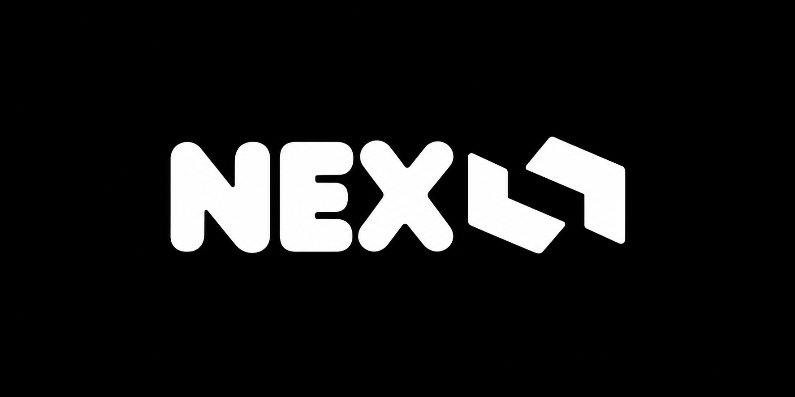
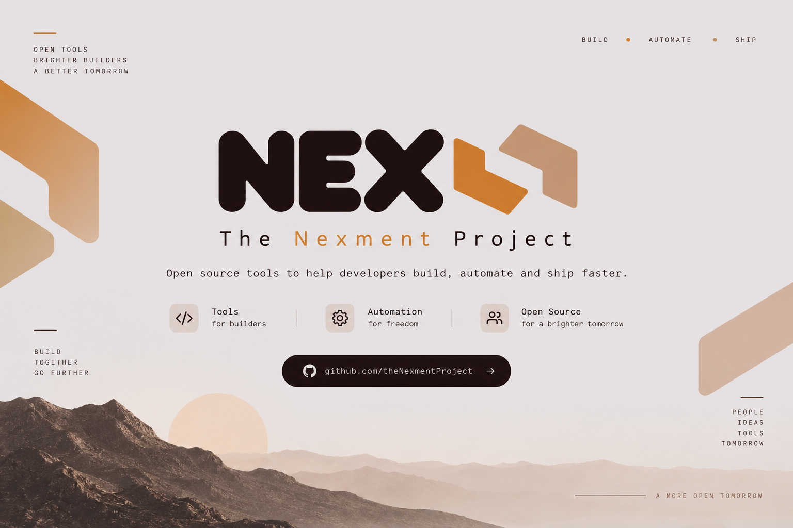

  

<h1 align="center">The Nexment Project</h1>

  <strong>Building simple, open-source tools for developers, creators, and builders.</strong>

  The Nexment Project is an independent open-source initiative focused on building
  practical, reliable, and developer-first software.

 

  

 

## The Philosophy

Nexment is built around a few principles that guide how we design, build, and maintain our projects.

### Privacy

Software should respect the people who use it. We aim to minimize unnecessary data collection and avoid building products that depend on invasive tracking or surveillance.

### Local

Whenever practical, data and processing should remain under the user's control. Local-first and self-hostable approaches are preferred when they provide a better experience without unnecessary dependence on external services.

### Secure

Security is not an afterthought. Projects should follow sensible security practices, keep dependencies under control, and make security-related decisions transparent wherever possible.

### Fast

Software should feel responsive and efficient. Nexment projects aim to avoid unnecessary complexity, excessive resource usage, and features that add more overhead than value.

### Open Source

Source code should be available for people to inspect, learn from, improve, and build upon. We believe open development creates better opportunities for collaboration and long-term sustainability.

 

## What We Build

The Nexment Project focuses on practical software rather than building technology simply for the sake of technology.

Our projects may include:

- Developer tools and command-line utilities
- Local-first and self-hostable software
- Libraries and reusable components
- Productivity tools
- Infrastructure and development utilities
- Experimental projects and new ideas
- Tools that improve existing developer workflows

Every project does not need to become a large platform. A small tool that solves one problem properly is valuable on its own.

 

## Our Approach

We prefer simple solutions over unnecessary complexity.

Nexment projects are designed with a focus on:

- Clear and maintainable code
- Useful documentation
- Predictable behavior
- Minimal dependencies where practical
- Strong privacy defaults
- Secure-by-design development
- Good developer experience
- Long-term maintainability
- Transparent development

We are not trying to build everything.

We are trying to build things that are worth using.

 

## Contribution

Nexment is an open-source project, and contributions are welcome.

Once a repository reaches a stable stage, contributions are allowed and encouraged. Contributions can include code, documentation, bug fixes, testing, improvements, issue reports, ideas, and other meaningful work.

Before contributing to any repository:

1. Read the repository's `CONTRIBUTING.md`.
2. Check the project's README and documentation.
3. Review existing issues and pull requests when relevant.
4. Follow the repository's development and contribution guidelines.
5. Keep changes focused and explain the reasoning behind significant changes.

Every repository may have its own rules depending on its technology, maturity, and purpose. The repository's `CONTRIBUTING.md` should always be treated as the primary contribution guide.

We want Nexment to remain open while also keeping its projects maintainable and reliable.

 

## Miscellaneous

### Licensing

Most Nexment projects are released under the **Apache License 2.0**.

Some repositories may use the **GNU General Public License v3.0** when its copyleft requirements are better suited to the project.

Always check the `LICENSE` file inside the individual repository for the exact license that applies to that project.

### Ownership

The Nexment Project is maintained and developed under the direction of:

**GitHub** - [@ansh8996](https://github.com/ansh8996)

**X** - [@founderNexment](https://x.com/founderNexment)

 

## The Nexment Project

Nexment is more than a collection of repositories.

It is an attempt to build useful software in an open, practical, and responsible way — without unnecessary complexity and without losing sight of the people who use it.

Projects may start small, change direction, or eventually become something much larger. The goal remains the same: build useful things, keep them open, and make them better over time.

 

  <strong>Built for developers with ❤️ from India 🇮🇳.</strong>

