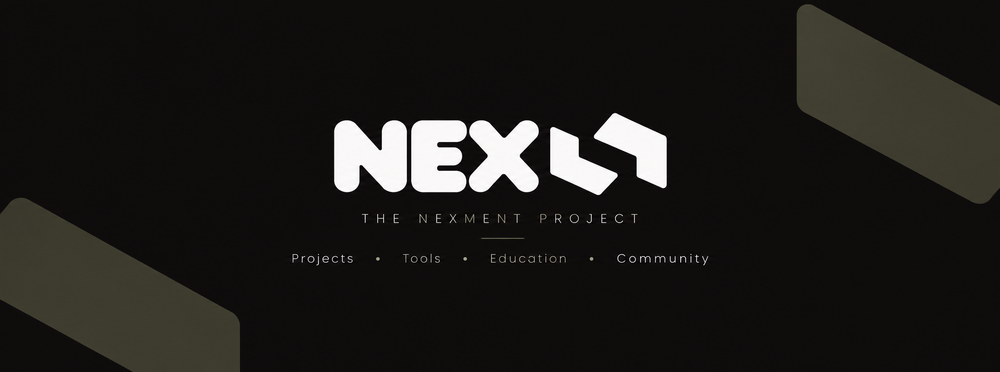
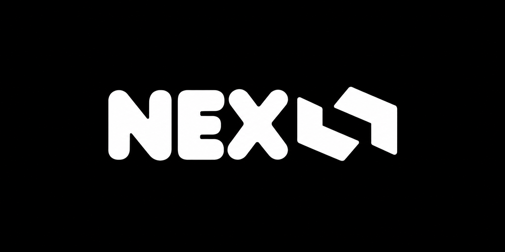

 
 

# The Nexment Project

 
 

**Free & open-source software, tools, and resources for developers.**

We build useful things, document what we learn, and occasionally break things so you don't have to.

[Website](https://app.nexment.in) · [Community](https://dev.nexment.in) · [YouTube](https://youtube.com/@NexmentProject) · [X](https://x.com/NexmentOfficial)

---

## What we do

🛠️ **Projects** — Developer tools and practical software.

📚 **Academy** — Free courses and learning resources for developers.

👥 **Community** — A place for developers to build, share, and learn together.

📖 **Docs & Blog** — Documentation, tutorials, experiments, and things worth reading.

🎥 **YouTube** — Tutorials, builds, technology, news, and whatever we're currently obsessed with.

---

## Our philosophy

Build useful things.  
Keep them accessible.  
Share what we learn.  
Don't overcomplicate it.

And yes, we probably started another project before finishing the last one.

---

**The Nexment Project**

Built for developers. Built in the open.

